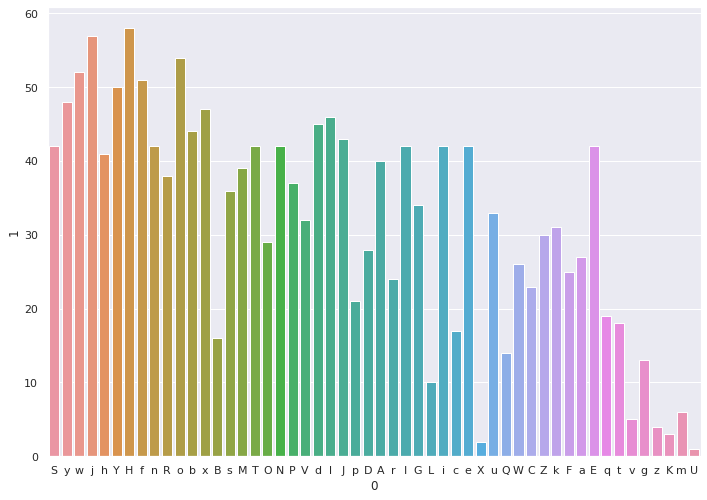
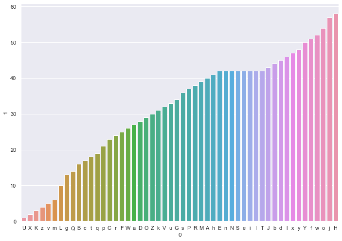

The hidden tip is in the frequency distribution analysis of the ciphered text.

This is the frequency distribution plot of the text:

If we sort it by the frequency of the text's letters, we can see an anomaly:

The letters "E", "n", "N", "S", "e", "i", "I" and "T" have all been repeated 42 times.

Sorting these letters by their ASCII number gives us the string "EINSTein".
